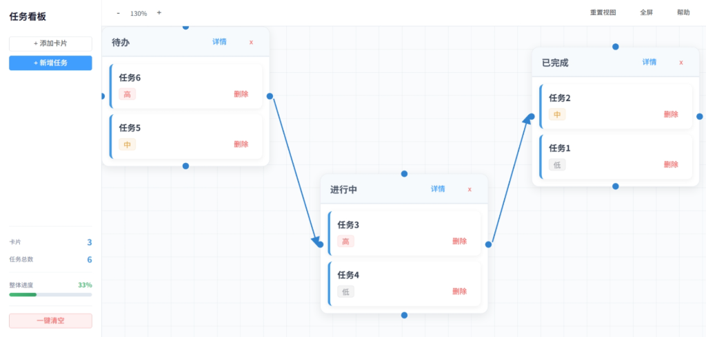
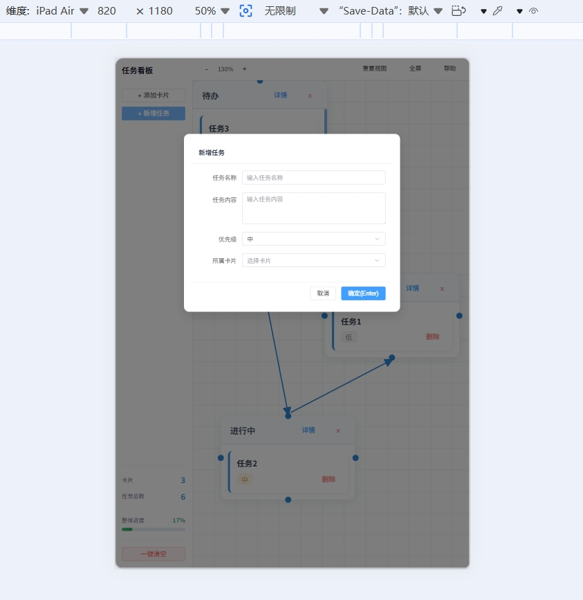
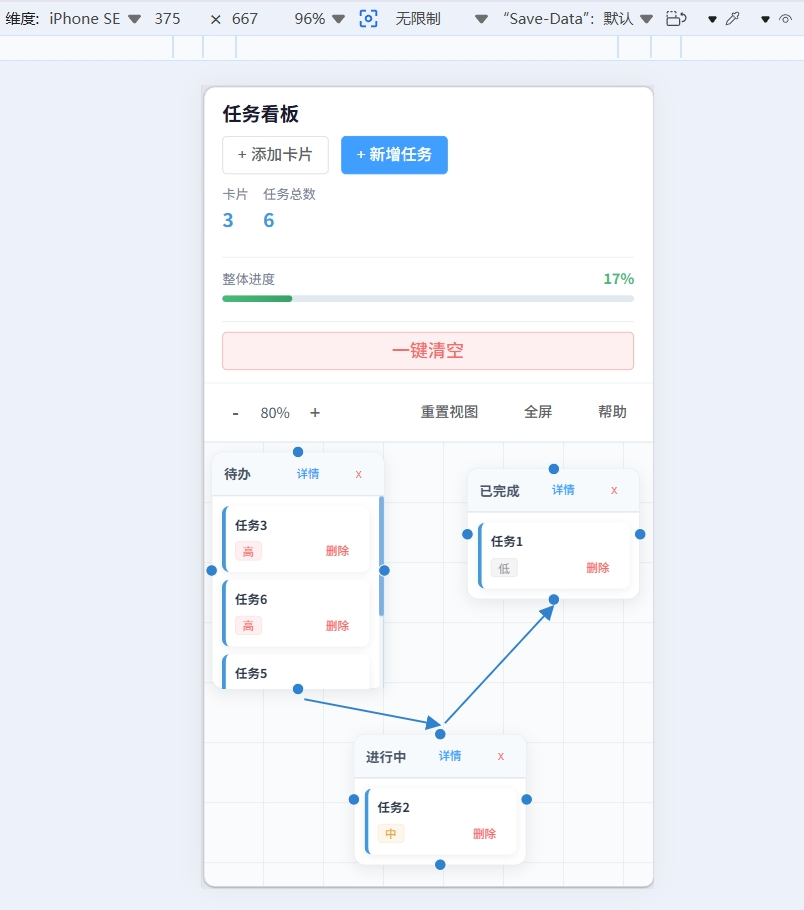

# 看板任务管理系统

仿 Trello 的看板式任务管理工具，支持拖拽排序、任务分类、进度追踪。

## 技术栈

- Vue 3
- Pinia
- Element Plus
- Sass

## 功能特点

- **拖拽排序**：支持任务拖拽到不同列，自动更新排序
- **任务分类**：按列（待办/进行中/已完成）分类管理任务
- **进度追踪**：实时统计任务总数和完成进度
- **增删改查**：任务卡片的添加、查看、编辑、删除
- **响应式布局**：支持 PC 端和移动端
- **数据持久化**：保存到 localStorage，刷新不丢失

## 项目介绍

这是一个练手项目，主要用来熟悉 Vue 3 + Pinia 的组合使用。一开始想做个简单的待办列表，后来想想 Trello 那种看板形式更有意思，就加上了拖拽功能。

刚开始写的时候，拖拽逻辑搞了好久，一开始用原生的 drag API，但是发现移动端不太行，后来又加了 touch 事件的兼容。状态管理一开始是放在组件里的，后来越来越复杂，就抽出来用 Pinia 了，确实清爽很多。

数据持久化本来想试试 IndexedDB，后来觉得 localStorage 够用了，就简单实现了一下。

## 项目截图

### PC 端视图

### 平板端

### 移动端视图

